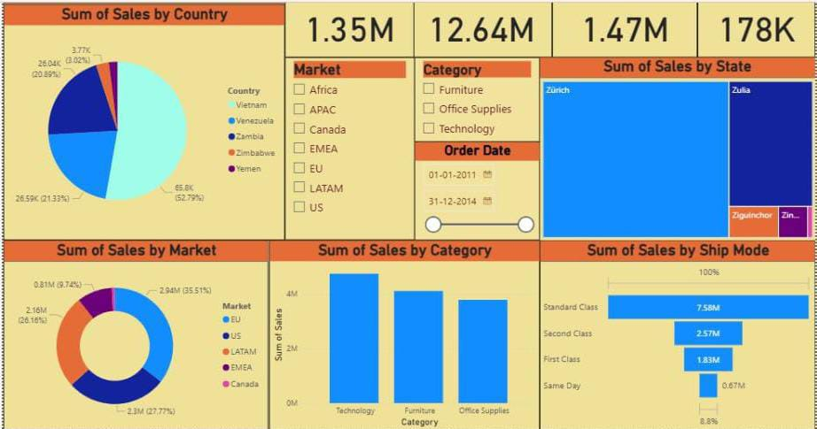

# E-commerce-report
This Power BI dashboard presents a detailed sales performance analysis for an E-commerce business. The report is designed to help decision-makers monitor trends, identify high-performing products, and understand customer purchasing patterns.

# Features Covered in This Report

- Country-wise Sales : Revenue comparison across different countries.
- State-wise Sales : Sales distribution within countries by states.
- Market Category Analysis : Consumer, Corporate, and Home Office segments.
- Shipping Mode Analysis : Performance of different shipping options.
- Dashboard Overview : Clean, interactive visuals designed in Power BI.

- Dashboard Preview

---

# Files Included

- [E-commerce report.pbix](./E-commerce%20report.pbix) – The Power BI report file.
- [dataset.xlsx](./dataset.xlsx) – The Excel file used as the data source.
- [dashboard.jpg – Screenshot of the main dashboard.

# Note: `
.pbix` and `.xlsx` are binary files — they cannot be previewed on GitHub.  
 Please download them and open in Power BI / Excel.

---

# Created By
  Neetu Singh 
  Power BI Enthusiast

